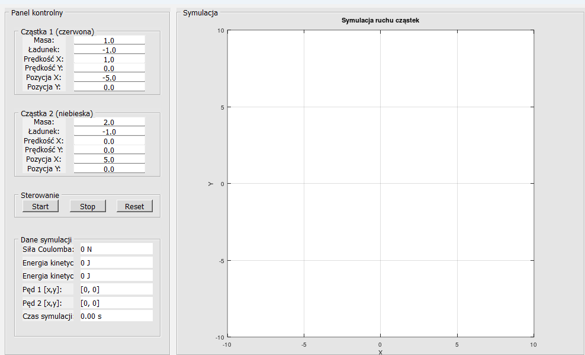
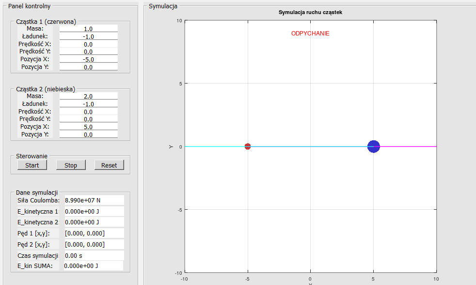

# zderzenia cząstek ładunków elektrycznych. 

**Przedmiot**: Programowanie 2 |semestr letni 2025 fizyka ogólna|

**Indeks**: 89219,

**Ważne linki**:
*   [Link do opisu zderzeń pdf](http://newton.ftj.agh.edu.pl/~tobola/informatyka/wyklady/W5/Zderzenia.pdf) - Podstawa teoretyczna zderzeń.
*   [Octave dokumentacja](https://docs.octave.org/latest/) - Zawsze pod ręką.

**Opis projektu**:
1.  stosując paradygmat programowania obiektowego w GNU/Octave:
2. program prezentujący zderzanie się cząstek i ich zachowanie z skutek zderzania, (rozpad itd), 
3. zderzanie typu jakiś akcelerator cząstek czy coś(cząstki są na jakimś relatywnie takim samym torze (*zasada nieoznaczoności heisenberga??*) i się rozpędzają -> na siebie.(**opcja 1**), jedna cząstka jest w miejscu.(**Opcja 2**) )
4.  możliwości: 
- wybór prędkości dla cząstki 1 i cząstki 2,
- tak samo możliwośc zmiany masy dla obu cząstek. 
5. Stworzenie GUI do tego. 
6. Wizualizacja wszystkiego. 

*Otrzymamy plik od dr. Brancewicza dotyczący opisu projektu przez nas.*
- zmienić imie i nazwisko, bez polskich liter,
- robic etapy, rozplanowanie według dokumentacji własnej, 
-  przygotować przekazywanie pędu
- opisać to itd 


## Rozplanowanie prac, 
**Ważne linki**:
- [Link do opisu zderzeń pdf](http://newton.ftj.agh.edu.pl/~tobola/informatyka/wyklady/W5/Zderzenia.pdf)
- [Opis jak tworzyć klasy](https://docs.octave.org/v4.2.1/Creating-a-Class.html#Creating-a-Class)
- [Octave dokumentacja](https://docs.octave.org/latest/)
# Etap 1:
Tworzenie potrzebnego aparatu matematycznego. 
1. Zachowanie pędu?
- jak to opisać? jak to obliczyć dla dwóch cząstek w octave? 
- dla przykładu jedna z nich jest nieruchoma a druga porusza się w strone tej pierwszej z jakąś prędkością.  
**Zachowanie pędu:**

$$ m_1v_1 + m_2v_2 =m_1v_1' + m_2v_2' $$

**Zachowanie energii dla zdarzeń idealnie sprężystych:**

$$(\frac{1}{2})[m_1v_{1}^{2}+ m_2v_{2}^{2} = m_1v_{1}'^{2}+ m_2v_{1}'^{2}]$$

2. Kierunek, zwroty, wektory: 
- *Jak  wyliczyć położenie cząstki, po odbiciu? przed odbiciem?*
- *kiedy następuje zderzenie?*

**Klasa `Particle`** [Link do pliku](tests/Particle.m)
Sytuacja wygląda tak, klasa `Particle` robi swoje, tworzy obiekt cząstki o takich a takich cechach i go aktualizalizuje co dany czas dt (`.update(dt)`) 
```matlab
        % Metoda do aktualizacji pozycji cząstki w czasie dt
        function obj = update(obj, dt)
            obj.position = obj.position + obj.velocity * dt;
        end
```
Oczywiście jest to poprzedzone czymś w rodzaju kontruktora z cpp. Czyli Clasa musi otrzymać jakieś parametry by się stworzyć i móc używać wbudowanych `metod` ~ czyli takich funkcji dostępnych tylko obiektów zrobionych na bazie ten klasy. 
```matlab
    %methods
        % Konstruktor
        function obj = Particle(mass, position, velocity, type)
            if nargin > 0
                obj.mass = mass;
                obj.position = position;
                obj.velocity = velocity;
                obj.type = type;
            end
        end


```
3. Tworzenie `Particles`: 
[Cern simulator testowanie tworzenie obiektów](tests/adding_obj.m) W tym pliku tworzyłem obiekty na bazie inputu uzytkownika i sprawdzałem jak się zmieniają w czasie.
- Trzeba sprawdzać rozmiar tych cząstek by razem z położeniem środka śledzić promień i jeśli odleglość pomiędzy $r_1 + r_2 <= d$ uruchomić program do odbijania. czy coś takiego [Dodałem sprawdzanie tego](tests/adding_obj.m)
- Zachowanie pędu, zderzenia, liczenie energii przy zderzeniu, 

## Notatki dotyczące rzeczy: 
**Jak tworzyć klasy?**
Bazując na poradniku ze strony octave; 
```octave
classdef nazwa_klasy
  properties 
  % tutaj są własciwosci typu private z cpp
  endproperties

  methods
  % co się dzieje z tą klasa, co mozna z nią zrobić???
  % zbiór różnych function
  % example:
    function disp(value)

  endmethods
endclassdef
```
W Pliku [klasy.m został pokazany](src/klasy.m) przyklad klasy, ktora wyswietla i tworzy wielomiany. 
by uruchomić trzeba: 
```bash 
>> p = klasy ([1,2,2,5])
p =

 1 + 2 * X + 2 * X ^ 2 + 5 * X ^ 3
```
> Jak widać liczby w nawiasie kwadratowym odpowadają wartości wspólczynników w wielomianie.

$$p = 1 + 2x + 2x^2 + 5x^3$$


# Zajęcia 2 Projektowanie CentralnegoElektrycznoRoboczegoNibySymulatora
- nie mozna uzyc nazwy cern simulator bo do chyba jakas obraza jest. 
-  co ty kurwa gnoju wiesz z fizyki ze wogle śniło ci się by wymawiać cos takiego, chujów sto i wypierdalaj robić jakieś nie dość że mozolne gówno to jeszcze męczące do animowania. Chcesz sie nauczyć fizycznych rzeczy to polecam ci bezubik zapierdalaj z łopatą. (Nie powiedział nic takiego ale powiedział coś o tym że nic nie wiem o cząstkach i sie nie znam)


**Projekt masz narysowany w zeszycie do optyki na koncu.**
**A zdjęcia są na dole dokumentacji**
[##strzały ekranu](O tutaj )


1.  **Etap 1: Matematyka i Fizyka (Zrobione)**
    *   **Zachowanie pędu i energii:** Wzory na zderzenia sprężyste są zaimplementowane w funkcji `updateSimulation` w sekcji kolizji cząstek. Suma energii kinetycznej jest śledzona w panelu informacyjnym (choć sama energia potencjalna nie jest liczona, więc suma kinetycznej nie musi być stała).
    *   **Siła Coulomba:** Obliczana w funkcji `calcCoulomb`.
    *   **Ruch:** Prosta metoda Eulera (`v = v + a*dt`, `p = p + v*dt`) w `updateSimulation`.

2.  **Etap 2: Podstawy Kodu (Zrobione)**
    *   **Struktura danych:** jednak  wyrąbane w te klasy używamy, struktury `struct()`  o nazwie `simData` do trzymania wszystkiego (stan cząstek, flagi, uchwyty GUI). To upraszcza przekazywanie danych między funkcjami w srodku.
```matlab
simData = struct()
% następnie by łatwiej funkcjonować octave robi dodatkowe elementy np. 
simData.particle1 = createParticle( "wstaw tutaj dane potrzebne do funkcji ");
simData.kochamMatiego = true;
simData.nazwa = "skibidi";

```
Po tych wszytkich ustawieniach i zabiegach mamy coś takieg gdzie `simData` posiada następujące miejsca którym nadaje się wartośći
```matlab
simData ={
    particle1,
    kochamMatiego,
    nazwa,
}
```
Octave samodzielnie tworzy brakujące pola do dodawania wiec nie trzeba się przejmować by je stworzyć ale lepiej pilnować **nazw**.

A dodatkowo prosze zobaczyć jak robię w pliku [Particle.m](particle.m przy uzyciu classy)

Dzięki tej formie zapisu danych (czyli uzycie klasy do zbudowania particle1 i 2) można łatwo je edyutować jako element `simData` i nie trzeba się martwić o to że coś się zepsuje.

```matlab 
% tak naprawde sim data wygląda w taki sposób w środku
simData{
    particle1{
        mass: ,
        charge: ,
        position: [],
        velocity: [],
    },
    kochamMatiego,
    nazwa,
}
% wiec poprzez
simData.particle1.mass = 2.6;
%moge zmieniać konkretne lementy w particle1

```

*   **Funkcje pomocnicze:** `createParticle`, `calcCoulomb`, `update...`  isnieją i mają się dobrze, są odpowiedzialne za oblicznanie rzeczy. 

3.  **Etap 3: Tworzenie GUI (Zrobione)**
    *   **Główne okno (`figure`):** Ustawienie rozmiaru, tytułu, funkcji zamykania.
    *   **Panele (`uipanel`):** Podział okna na logiczne sekcje (kontrola, symulacja, ustawienia cząstek, przyciski, info). Ułatwia organizację.
    *   **Kontrolki (`uicontrol`):**
        *   `'Style', 'text'`: Etykiety opisujące inne kontrolki lub wyświetlające dane.
        *   `'Style', 'edit'`: Pola do wprowadzania wartości przez użytkownika (masa, ładunek, prędkość, pozycja). Mają ustawioną funkcję zwrotną (`'Callback', @updateParticles`), która odpala się po zmianie wartości.
        *   `'Style', 'pushbutton'`: Przyciski (Start, Stop, Reset). Też mają swoje funkcje zwrotne (`@startSimulation`, `@stopSimulation`, `@resetSimulation`).
    *   **Obszar rysowania (`axes`):** Miejsce w panelu symulacji, gdzie rysujemy cząstki, trajektorie i wektory. Ma ustawione granice (`XLim`, `YLim`) i proporcje (`DataAspectRatio`).
    *   **Grafika (`plot`, `quiver`, `text`):**
        *   `plot(..., 'o')`: Rysuje markery cząstek. Uchwyty (`p1Handle`, `p2Handle`) pozwalają zmieniać ich pozycję (`XData`, `YData`) i rozmiar (`MarkerSize`).
        *   `plot(..., '-')`: Rysuje linie trajektorii. Uchwyty (`p1TrajectoryHandle`, ...) pozwalają aktualizować dane (`XData`, `YData`) na podstawie historii pozycji.
        *   `quiver(...)`: Rysuje strzałki (wektory) prędkości i sił. Uchwyty pozwalają zmieniać ich początek (`XData`, `YData`) i składowe (`UData`, `VData`).
        *   `text(...)`: Wyświetla tekst (np. typ interakcji) na obszarze rysowania.

4.  **Etap 4: Połączenie Logiki z GUI (Zrobione)**
    *   **Pętla symulacji (`timerLoop`, `updateSimulation`):** Serce programu. Działa w tle (dzięki `pause` i `drawnow`), liczy fizykę i regularnie aktualizuje stan w `simData`.
    *   **Aktualizacja GUI:** Funkcje `update...` (np. `updateVelocityVectors`, `updateSimulationData`) oraz bezpośrednie komendy `set(...)` w `updateSimulation` zmieniają wygląd kontrolek i grafiki na podstawie danych w `simData`.
    *   **Interakcja użytkownika:** Callbacki przycisków (`startSimulation`, ...) i pól edycji (`updateParticles`) modyfikują `simData` (np. zmieniają `simData.isRunning` lub wartości parametrów cząstek) i odpalają odpowiednie akcje.

---

## Jak Tworzyć Elementy GUI
Tworzenie interfejsu w Octave opiera się głównie na kilku funkcjach:

1.  **`figure` - Główne Okno**
    *   Wywołanie `fig = figure(...)` tworzy nowe okno. Było na zajeciach jest w każdym programie 
    *   Ważne właściwości (podawane jako pary 'Nazwa', Wartość):
        *   `'Name'`: Tytuł okna.
        *   `'Position'`: `[lewy_dolny_x, lewy_dolny_y, szerokość, wysokość]` w pikselach.
        *   `'Units'`: W jakich jednostkach podajemy `Position` (np. `'pixels'`, `'normalized'`). `'normalized'` jest super do skalowania.
        *   `'MenuBar'`, `'NumberTitle'`: Kontrola wyglądu okna.
        *   `'CloseRequestFcn'`: `@nazwa_funkcji` - co ma się stać po kliknięciu 'X'. u mnie logiczne ma sie skonczyć program czyli ->`@exitProgram`.

2.  **`uipanel` - Kontener/Sekcja**
    *   Służy do grupowania innych elementów. `panel = uipanel('Parent', rodzic, ...)`
    *   `'Parent'`: Do jakiego okna (`figure`) lub innego panelu należy ten panel.
    *   `'Title'`: Napis na ramce panelu.
    *   `'Position'`: Położenie i rozmiar *wewnątrz rodzica*. Jeśli rodzic ma `'Units', 'normalized'`, to i tu warto użyć `'normalized'`.
    *   `'BackgroundColor'`: Kolor tła.

3.  **`axes` - Obszar Wykresu**
    *   Miejsce do rysowania. `ax = axes('Parent', rodzic, ...)`
    *   `'Parent'`: Zazwyczaj panel przeznaczony na symulację.
    *   `'Position'`: Położenie i rozmiar wewnątrz rodzica.
    *   `'XLim'`, `'YLim'`: Zakresy osi.
    *   `'DataAspectRatio', [1 1 1]`: Żeby koła były kołami, a nie elipsami.
    *   `'Box'`, `'Grid'`: Włączenie ramki i siatki.

4.  **`uicontrol` - Przyciski, Pola Tekstowe, Edycja itp.**
    *   Najbardziej wszechstronne narzędzie. `uchwyt = uicontrol('Parent', rodzic, 'Style', styl, ...)`
    *   `'Parent'`: Panel lub okno, w którym ma się pojawić.
    *   `'Style'`: Kluczowa właściwość, decyduje o typie kontrolki:
        *   `'text'`: Zwykła etykieta tekstowa. Używamy do opisów lub wyświetlania danych (np. `forceText`). Właściwość `'String'` przechowuje tekst. `'HorizontalAlignment'` kontroluje wyrównanie.
        *   `'edit'`: Pole do wpisywania tekstu/liczb przez użytkownika. `'String'` zawiera wpisaną wartość. `'Callback'` definiuje funkcję do wywołania po edycji.
        *   `'pushbutton'`: Przycisk. `'String'` to napis na przycisku. `'Callback'` definiuje funkcję do wywołania po kliknięciu.
        *   Inne style: `'slider'`, `'checkbox'`, `'radiobutton'`, `'popupmenu'`...
    *   `'Position'`: Położenie i rozmiar wewnątrz rodzica.
    *   `'String'`: Tekst na etykiecie/przycisku lub wartość w polu edycji.
    *   `'Callback'`: `@nazwa_funkcji` - najważniejsze dla interaktywności! Łączy akcję użytkownika (klik, edycja) z kodem Octave.

5.  **Uchwyty (Handles)**
    *   Kiedy tworzysz element GUI (np. `przycisk = uicontrol(...)`), zmienna `przycisk` przechowuje "uchwyt" do tego elementu.
    *   Uchwyty są niezbędne, żeby później móc modyfikować właściwości elementów za pomocą funkcji `set()`. Np.:
        *   `set(p1Handle, 'XData', nowa_pozycja_x)` - przesuwa marker cząstki.
        *   `set(forceText, 'String', obliczona_sila)` - aktualizuje wyświetlaną siłę.
        *   `get(p1MassEdit, 'String')` - odczytuje wartość wpisaną przez użytkownika.
    *   Warto przechowywać ważne uchwyty w strukturze `simData`, żeby były łatwo dostępne z różnych funkcji.

6.  **`drawnow()` i `pause()` w Pętli**
    *   W pętli symulacji (`timerLoop`) `drawnow()` wymusza odświeżenie okna GUI, żeby zmiany były widoczne.
    *   `pause(dt)` wprowadza opóźnienie, kontrolując szybkość symulacji i dając GUI czas na reakcję.

**Podsumowując:** Układasz elementy w oknie (`figure`, `uipanel`, `axes`, `uicontrol`), nadajesz im właściwości (rozmiar, pozycję, tekst, styl). Zapisujesz uchwyty do elementów, które będziesz zmieniać. Piszesz funkcje (`callbacki`), które reagują na akcje użytkownika lub postęp symulacji. W tych funkcjach używasz `get()` do odczytu danych z GUI i `set()` do aktualizacji wyglądu GUI. Całość spinasz pętlą z `drawnow()` i `pause()`. Chaotyczne? Może trochę, ale działa!

---

## strzały ekranu (screenshots)






