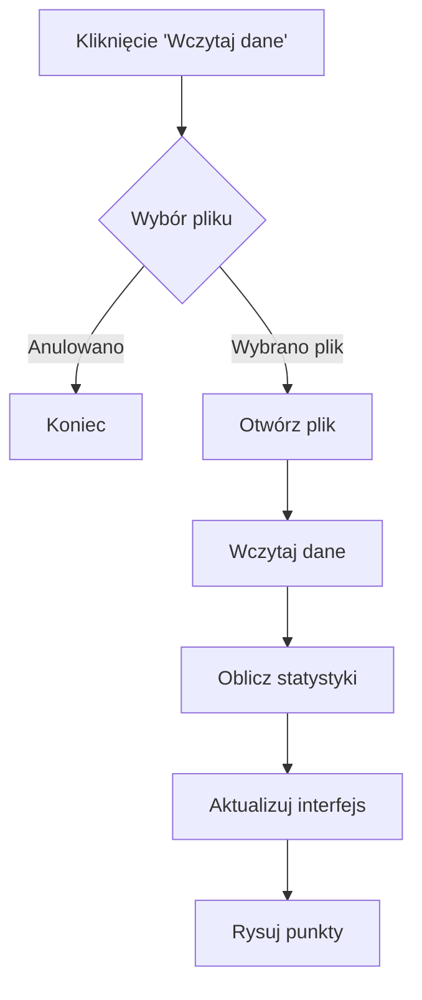
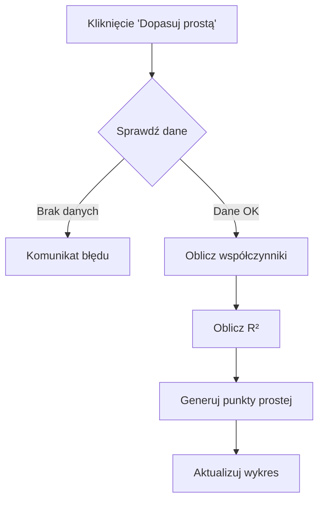

# Logika Działania Programu do Dopasowania Prostej
Data dokumentacji: 2025-03-24 15:09:03
Autor: kitajusSus

## 1. Przepływ Danych i Logika Działania

### 1.1 Struktura Danych
Program wykorzystuje strukturę `h` do przechowywania wszystkich istotnych danych:
```octave
h = {
    data_x: [],          # tablica wartości X
    data_y: [],          # tablica wartości Y
    a: 0,               # współczynnik kierunkowy prostej
    b: 0,               # wyraz wolny prostej
    R_squared: 0,       # współczynnik determinacji
    x_fit: [],          # punkty X do rysowania prostej
    y_fit: [],          # punkty Y do rysowania prostej
    liczba_punktow: 0,  # liczba punktów danych
    min_x: 0,          # minimalna wartość X
    max_x: 0,          # maksymalna wartość X
    min_y: 0,          # minimalna wartość Y
    max_y: 0           # maksymalna wartość Y
}
```

### 1.2 Główny Przepływ Programu

1. **Inicjalizacja**
   ```octave
   close all;
   clear all;
   graphics_toolkit qt
   ```
   - Czyszczenie przestrzeni roboczej
   - Przygotowanie środowiska graficznego

2. **Tworzenie Interfejsu**
   - Główne okno
   - Obszar wykresu
   - Przyciski i kontrolki
   - Wszystkie elementy są powiązane z funkcją `update_plot`

3. **Obsługa Zdarzeń**
   Każde zdarzenie jest przetwarzane przez funkcję `update_plot`:
   ```octave
   switch (gcbo)
     case {h.ladowanie_danych}
       # obsługa wczytywania
     case {h.przycisk_dopasowania}
       # obsługa dopasowania
     case {h.przycisk_zapisywanie}
       # obsługa zapisu
     # ...
   endswitch
   ```

## 2. Szczegółowa Analiza Logiki

### 2.1 Wczytywanie Danych


1. Otwieranie pliku:
   ```octave
   [filename, filepath] = uigetfile({...})
   ```

2. Wczytywanie danych:
   ```octave
   plik1 = fopen(fullpath, "rt");
   data = textscan(plik1, "%f %f %s");
   ```
   - %f - liczba zmiennoprzecinkowa
   - %s - tekst/string (komentarz)

3. Przetwarzanie danych:
   ```octave
   h.data_x = data{1};  # pierwsza kolumna
   h.data_y = data{2};  # druga kolumna
   ```

### 2.2 Dopasowanie Prostej

#### Algorytm dopasowania:


1. **Obliczanie współczynników** (metoda najmniejszych kwadratów):
   ```octave
   [p, s] = polyfit(h.data_x, h.data_y, 1);
   h.a = p(1);  # współczynnik kierunkowy
   h.b = p(2);  # wyraz wolny
   ```

2. **Obliczanie R²**:
   ```octave
   y_fit = polyval(p, h.data_x);
   SS_total = sum((h.data_y - mean(h.data_y)).^2);
   SS_residual = sum((h.data_y - y_fit).^2);
   R_squared = 1 - (SS_residual / SS_total);
   ```

3. **Generowanie punktów prostej**:
   ```octave
   h.x_fit = linspace(min(h.data_x), max(h.data_x), 100);
   h.y_fit = polyval(p, h.x_fit);
   ```

### 2.3 System Aktualizacji Wykresu

#### Logika aktualizacji:
```octave
if (replot && isfield(h, "x_fit") && isfield(h, "y_fit"))
    # Pobranie ustawień
    # Wyczyszczenie wykresu
    # Narysowanie danych
    # Narysowanie prostej
    # Aktualizacja legendy
endif
```

1. **Warunki aktualizacji**:
   - `replot` - flaga wymagająca przerysowania
   - Istnienie danych dopasowania

2. **Kolejność rysowania**:
   ```octave
   cla(h.ax);              # czyszczenie
   hold(h.ax, "on");       # zachowanie warstw
   plot(...);              # dane
   plot(...);              # prosta
   hold(h.ax, "off");      # zakończenie
   ```

### 2.4 System Zapisywania

#### Logika zapisu wyników:
```octave
if (isfield(h, "a") && isfield(h, "b"))
    # Otwarcie pliku
    # Zapisanie nagłówka
    # Zapisanie wyników
    # Zapisanie danych
    # Zamknięcie pliku
endif
```

1. **Format zapisu**:
   ```octave
   fprintf(zapisany_file, "# Wyniki dopasowania prostej\n");
   fprintf(zapisany_file, "# Data: %s\n\n", datestr(now));
   fprintf(zapisany_file, "# Równanie prostej: y = %.6f * x + %.6f\n", h.a, h.b);
   ```

### 2.5 Zarządzanie Pamięcią

1. **Przechowywanie danych GUI**:
   ```octave
   guidata(gcf, h)  # zapisanie
   h = guidata(obj) # odczytanie
   ```

2. **Czyszczenie pamięci**:
   ```octave
   clear all  # przy starcie
   cla(h.ax)  # przy aktualizacji wykresu
   ```

## 3. Obsługa Błędów

### 3.1 Walidacja Danych
```octave
try
    # Próba wczytania danych
catch
    set(h.info_text, "string", "Błąd wczytywania pliku. Sprawdź format.");
end_try_catch
```

### 3.2 Zabezpieczenia
1. Sprawdzanie istnienia danych przed dopasowaniem
2. Weryfikacja formatu pliku
3. Kontrola zakresu wartości w kontrolkach

## 4. Optymalizacja

1. **Wydajność rysowania**:
   - Przerysowanie tylko gdy konieczne (flaga `replot`)
   - Buforowanie punktów prostej

2. **Zarządzanie pamięcią**:
   - Czyszczenie nieużywanych zmiennych
   - Efektywne przechowywanie danych w strukturze `h`